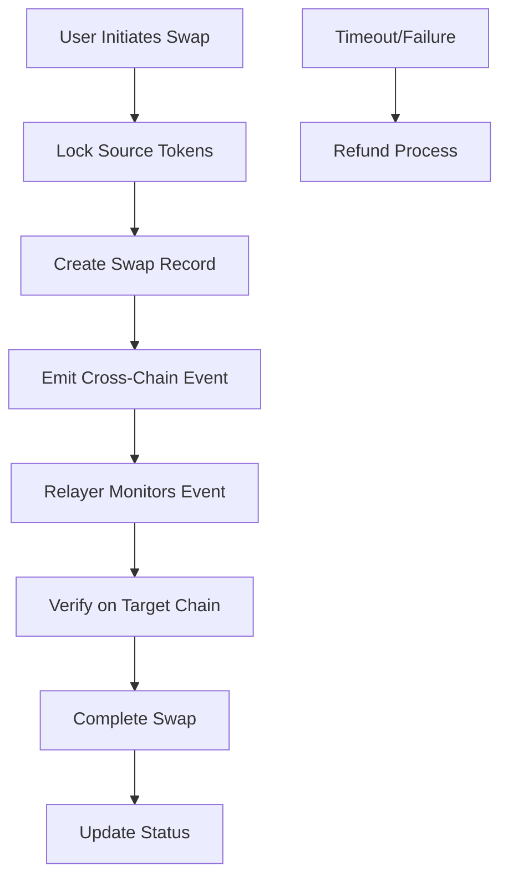

# Architecture Documentation

## Cross-Chain Liquidity Aggregator Architecture

This document provides a comprehensive overview of the Cross-Chain Liquidity Aggregator's architecture, design decisions, and technical implementation.

## 🏗️ System Overview

The Cross-Chain Liquidity Aggregator is a decentralized finance (DeFi) protocol built on the Stacks blockchain that enables:

- **Liquidity Provision**: Users can provide liquidity to token pairs
- **Token Swapping**: Automated market making for token exchanges
- **Cross-Chain Operations**: Bridge functionality for multi-chain asset transfers
- **Fee Management**: Configurable fee structures for sustainability

## 🔧 Core Components

### 1. Smart Contract Layer

#### Main Contract: `cross-chain-liquidity-aggregator.clar`

The core protocol contract implementing:

```clarity
;; Core data structures
(define-map pools uint {...})           ;; Pool information storage
(define-map pool-lookup {...} uint)     ;; Token pair to pool ID mapping
(define-map liquidity-shares {...} uint) ;; LP token balances
(define-map cross-chain-swaps uint {...}) ;; Cross-chain swap tracking
```

**Key Functions:**
- Pool management (create, activate/deactivate)
- Liquidity operations (add/remove)
- Token swapping with AMM pricing
- Cross-chain swap initiation and completion
- Administrative controls

#### Supporting Contracts

- **`sip-010-trait.clar`**: Standard fungible token interface
- **`mock-token-a.clar`** & **`mock-token-b.clar`**: Test tokens for development

### 2. Automated Market Maker (AMM)

#### Pricing Formula

The protocol uses the constant product formula:

```
x * y = k
```

Where:
- `x` = Reserve of token A
- `y` = Reserve of token B  
- `k` = Constant product

#### Swap Calculation

```clarity
output = (input * (10000 - fee) * reserve_out) / 
         (reserve_in * 10000 + input * (10000 - fee))
```

#### Fee Structure

- **Pool Fees**: Configurable per pool (default 0.3%)
- **Protocol Fees**: Global fee for protocol development
- **Cross-Chain Fees**: Additional fees for bridge operations

### 3. Cross-Chain Bridge Architecture

#### Swap Lifecycle



#### Security Mechanisms

- **Time-based Expiration**: Swaps expire after specified blocks
- **Proof Verification**: Cryptographic proofs for cross-chain validation
- **Multi-signature Support**: Enhanced security for large transfers
- **Emergency Controls**: Pause functionality for critical issues

## 📊 Data Architecture

### Pool Structure

```clarity
{
  token-a: principal,        ;; First token contract
  token-b: principal,        ;; Second token contract
  reserve-a: uint,           ;; Token A reserves
  reserve-b: uint,           ;; Token B reserves
  total-supply: uint,        ;; Total LP tokens
  fee-rate: uint,            ;; Pool fee in basis points
  created-at: uint,          ;; Creation block height
  active: bool               ;; Pool status
}
```

### Cross-Chain Swap Structure

```clarity
{
  initiator: principal,           ;; Swap initiator
  source-token: principal,        ;; Source token
  target-token: string-ascii,     ;; Target token address
  source-amount: uint,            ;; Source amount
  target-amount: uint,            ;; Target amount
  target-chain: string-ascii,     ;; Target blockchain
  target-address: string-ascii,   ;; Recipient address
  status: string-ascii,           ;; Swap status
  created-at: uint,               ;; Creation time
  expires-at: uint                ;; Expiration time
}
```

## 🔐 Security Architecture

### Access Control

```clarity
;; Owner-only functions
(define-private (is-owner)
  (is-eq tx-sender CONTRACT_OWNER))

;; Function-level access control
(asserts! (is-owner) ERR_UNAUTHORIZED)
```

### Input Validation

```clarity
;; Amount validation
(asserts! (> amount u0) ERR_INVALID_AMOUNT)

;; Balance checks
(asserts! (<= amount (get-balance sender)) ERR_INSUFFICIENT_BALANCE)

;; Slippage protection
(asserts! (>= amount-out min-amount-out) ERR_SLIPPAGE_TOO_HIGH)
```

### State Protection

- **Atomic Operations**: All state changes are atomic
- **Overflow Protection**: Safe math operations throughout
- **Reentrancy Prevention**: Proper function ordering
- **Emergency Pause**: Global pause mechanism

## 🌐 Network Architecture

### Supported Networks

1. **Stacks Mainnet**: Production deployment
2. **Stacks Testnet**: Testing and development
3. **Local Devnet**: Development environment

### Cross-Chain Support

Currently designed for:
- **Bitcoin**: Primary settlement layer
- **Stacks**: Smart contract execution layer
- **Future Chains**: Extensible architecture for additional chains

## 📈 Scalability Considerations

### Gas Optimization

- **Efficient Data Structures**: Optimized storage layouts
- **Batch Operations**: Multiple operations in single transaction
- **Lazy Evaluation**: Compute values only when needed

### Performance Features

- **Pool Lookup Optimization**: Bidirectional token pair mapping
- **Cached Calculations**: Store frequently accessed values
- **Event-Driven Updates**: Minimize on-chain computation

## 🔄 Integration Architecture

### Frontend Integration

```javascript
// React component integration
import { useConnect } from '@stacks/connect-react';

const { doContractCall } = useConnect();

// Contract interaction
await doContractCall({
  contractAddress: 'ST1....',
  contractName: 'cross-chain-liquidity-aggregator',
  functionName: 'swap-tokens',
  functionArgs: [...]
});
```

### Backend Integration

```javascript
// Node.js API integration
const { callReadOnlyFunction } = require('@stacks/transactions');

// Read contract state
const result = await callReadOnlyFunction({
  contractAddress: 'ST1....',
  contractName: 'cross-chain-liquidity-aggregator',
  functionName: 'get-pool',
  functionArgs: [uintCV(poolId)]
});
```

## 🧪 Testing Architecture

### Test Categories

1. **Unit Tests**: Individual function testing
2. **Integration Tests**: Multi-contract interactions
3. **Security Tests**: Access control and edge cases
4. **Performance Tests**: Gas usage and optimization
5. **Cross-Chain Tests**: Bridge functionality

### Test Structure

```typescript
Clarinet.test({
  name: "Test description",
  async fn(chain: Chain, accounts: Map<string, Account>) {
    // Setup
    const deployer = accounts.get('deployer')!;
    
    // Execute
    let block = chain.mineBlock([
      Tx.contractCall('contract', 'function', args, sender)
    ]);
    
    // Assert
    assertEquals(block.receipts.length, 1);
    block.receipts[0].result.expectOk();
  }
});
```

## 🚀 Deployment Architecture

### Environment Configuration

```toml
# Clarinet.toml
[networks]
testnet = "https://stacks-node-api.testnet.stacks.co"
mainnet = "https://stacks-node-api.mainnet.stacks.co"

[networks.devnet]
host = "localhost"
port = 20443
```

### Deployment Pipeline

1. **Pre-deployment Checks**
   - Contract syntax validation
   - Comprehensive test execution
   - Security audit verification

2. **Staged Deployment**
   - Testnet deployment and verification
   - Integration testing
   - Mainnet deployment

3. **Post-deployment Verification**
   - Contract functionality testing
   - Integration verification
   - Monitoring setup

## 📊 Monitoring and Analytics

### Key Metrics

- **Total Value Locked (TVL)**: Sum of all pool reserves
- **Trading Volume**: 24h/7d/30d trading volumes
- **Pool Utilization**: Reserve utilization rates
- **Cross-Chain Activity**: Bridge transaction volumes
- **Fee Generation**: Protocol and LP fee collection

### Event Monitoring

```clarity
;; Contract events for monitoring
(print {
  type: "pool-created",
  pool-id: pool-id,
  token-a: token-a,
  token-b: token-b
})

(print {
  type: "swap-executed",
  pool-id: pool-id,
  amount-in: amount-in,
  amount-out: amount-out
})
```

## 🔮 Future Architecture Considerations

### Planned Enhancements

1. **Multi-Chain Expansion**: Support for Ethereum, Polygon, etc.
2. **Advanced AMM Models**: Concentrated liquidity, stable swaps
3. **Governance Integration**: Decentralized protocol governance
4. **Layer 2 Integration**: Scaling solutions integration
5. **MEV Protection**: Front-running and sandwich attack prevention

### Upgrade Mechanisms

- **Modular Design**: Separate concerns for easier upgrades
- **Proxy Patterns**: Upgradeable contract architecture
- **Migration Tools**: Data migration utilities
- **Backward Compatibility**: Maintain API compatibility

## 📚 Technical References

### Standards Compliance

- **SIP-010**: Stacks Fungible Token Standard
- **SIP-009**: Stacks Non-Fungible Token Standard (future)
- **EIP-20**: Ethereum Token Standard (cross-chain)

### Dependencies

- **Clarity**: Smart contract language
- **Stacks.js**: JavaScript SDK
- **Clarinet**: Development and testing framework

### External Integrations

- **Price Oracles**: For accurate price feeds
- **Bridge Protocols**: For cross-chain functionality
- **Wallet Integrations**: Multiple wallet support

This architecture provides a robust foundation for decentralized cross-chain liquidity aggregation while maintaining security, scalability, and extensibility.
